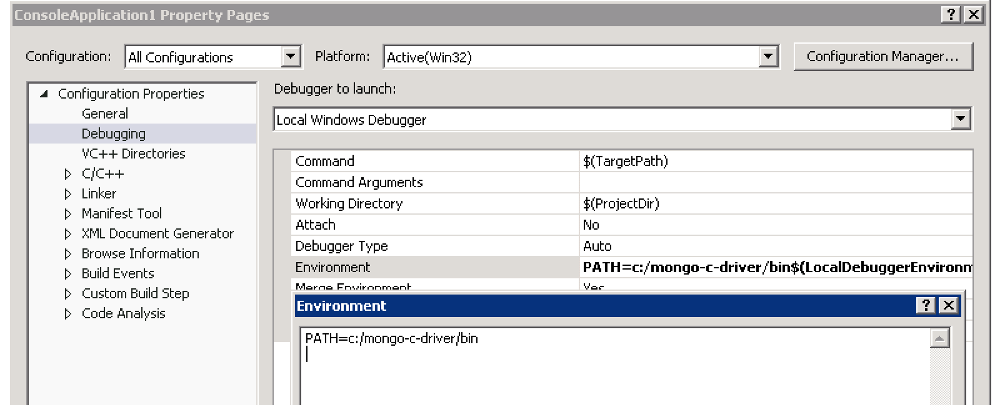

Using libmongoc in a Microsoft Visual Studio project
====================================================

:ref:`Download and install libmongoc on your system <build-on-windows>`, then open Visual Studio, select "File |rarrow| New |rarrow| Project...", and create a new Win32 Console Application.

.. image::
  static/msvc-create-project.png

Remember to switch the platform from 32-bit to 64-bit:

.. image::
  static/msvc-switch-architecture.png

Right-click on your console application in the Solution Explorer and select "Properties". Choose to edit properties for "All Configurations", expand the "C/C++" options and choose "General". Add to the "Additional Include Directories" these paths:

.. code-block:: text

  C:\mongo-c-driver\include\libbson-1.0
  C:\mongo-c-driver\include\libmongoc-1.0

.. image::
  static/msvc-add-include-directories.png

(If you chose a different ``CMAKE_INSTALL_PREFIX`` :ref:`when you ran CMake <build-on-windows>`, your include paths will be different.)

Also in the Properties dialog, expand the "Linker" options and choose "Input", and add to the "Additional Dependencies" these libraries:

.. code-block:: text

  C:\mongo-c-driver\lib\bson-1.0.lib
  C:\mongo-c-driver\lib\mongoc-1.0.lib

.. image::
  static/msvc-add-dependencies.png

Adding these libraries as dependencies provides linker symbols to build your application, but to actually run it, libbson's and libmongoc's DLLs must be in your executable path. Select "Debugging" in the Properties dialog, and set the "Environment" option to:

.. code-block:: text

  PATH=c:/mongo-c-driver/bin

Finally, include "mongoc.h" in your project's "stdafx.h":

.. code-block:: c

  #include <mongoc.h>

Now you can build and debug applications in Visual Studio that use libbson and libmongoc. Proceed to :ref:`making-a-connection` in the tutorial to learn how connect to MongoDB and perform operations.

.. turn "rarrow" above into right-arrow with no spaces around it

.. |rarrow| unicode:: U+2192
  :trim:
